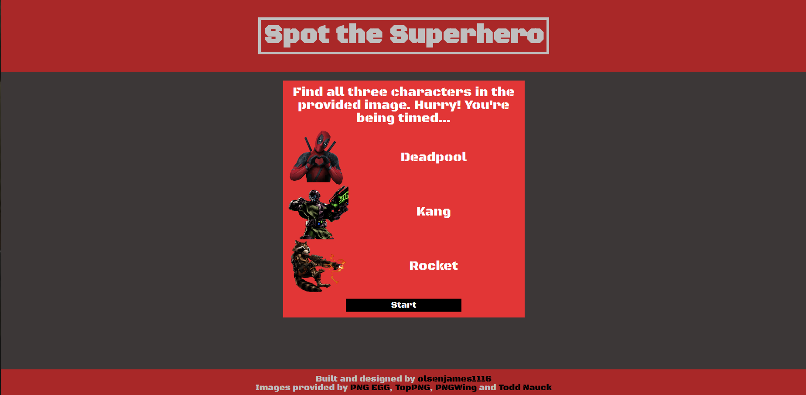
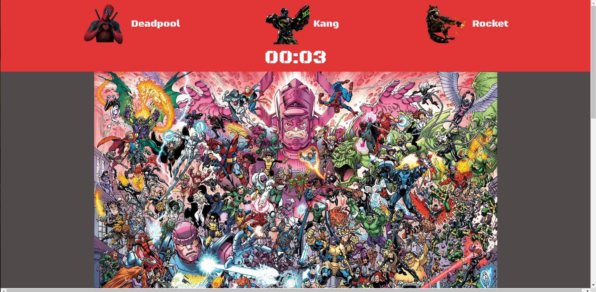
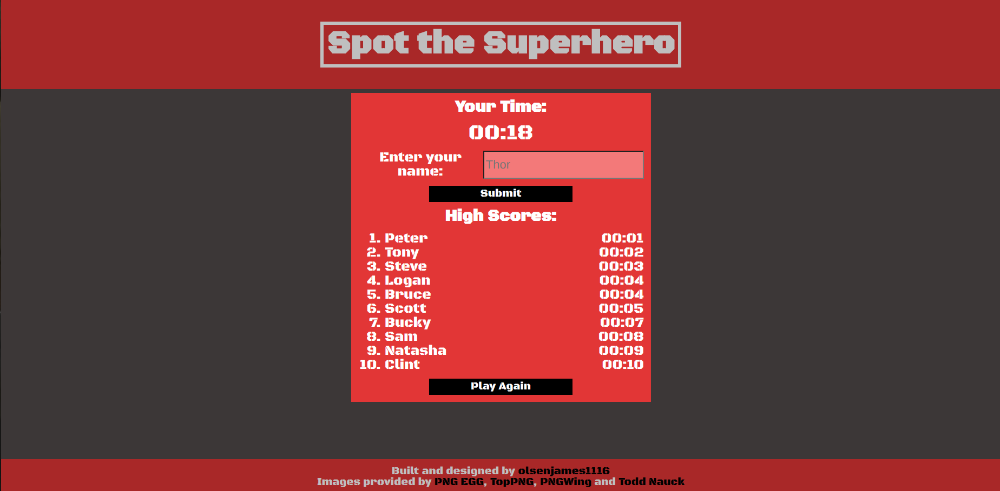

# photo-tagging-app

## Previews

Welcome:

Game:

Exit:

## Description

A game that uses similar rules to Where's Waldo. Search the image for the target characters, click when you think you've found them and select from the dropdown list to verify your selection. To score this game, the user will be timed. Once complete, enter your name and submit your score to store it and potentially make it on the leaderboard!

This project highlights:

- React
- OOP
- Hooks
- Redux
- Firebase
- Database queries
- Async/await
- PropTypes
